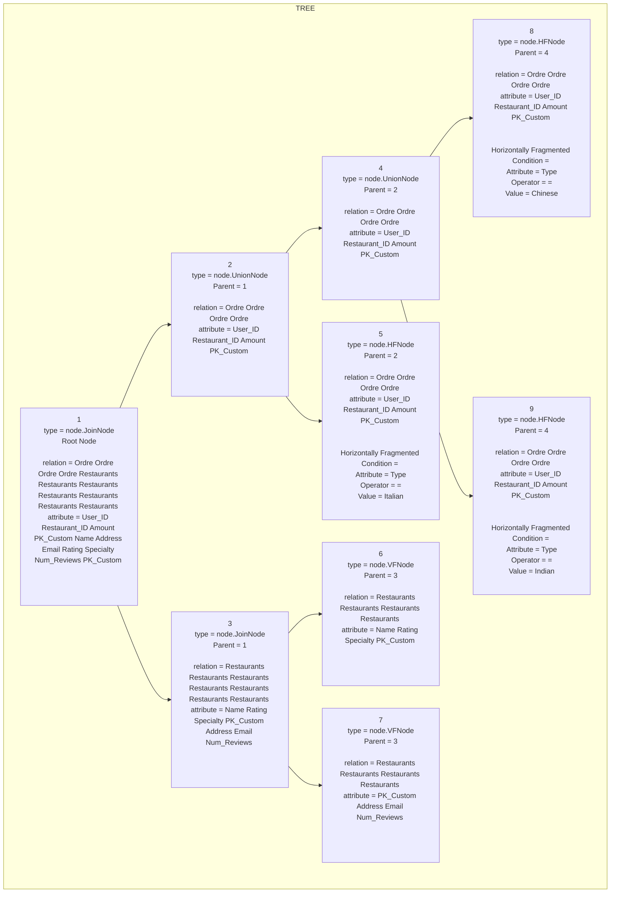

```mermaid
graph TD
subgraph TREE
1[1<br/>type = node.JoinNode<br/>Root Node<br/><br/>relation = Ordre Ordre Ordre Ordre Restaurants Restaurants Restaurants Restaurants Restaurants Restaurants Restaurants <br/>attribute = User_ID Restaurant_ID Amount PK_Custom Name Address Email Rating Specialty Num_Reviews PK_Custom <br/><br/><br/><br/>]
2[2<br/>type = node.UnionNode<br/>Parent = 1<br/><br/>relation = Ordre Ordre Ordre Ordre <br/>attribute = User_ID Restaurant_ID Amount PK_Custom <br/><br/><br/><br/>]
1-->2
3[3<br/>type = node.JoinNode<br/>Parent = 1<br/><br/>relation = Restaurants Restaurants Restaurants Restaurants Restaurants Restaurants Restaurants <br/>attribute = Name Rating Specialty PK_Custom Address Email Num_Reviews <br/><br/><br/><br/>]
1-->3
4[4<br/>type = node.UnionNode<br/>Parent = 2<br/><br/>relation = Ordre Ordre Ordre Ordre <br/>attribute = User_ID Restaurant_ID Amount PK_Custom <br/><br/><br/><br/>]
2-->4
5[5<br/>type = node.HFNode<br/>Parent = 2<br/><br/>relation = Ordre Ordre Ordre Ordre <br/>attribute = User_ID Restaurant_ID Amount PK_Custom <br/><br/><br/>Horizontally Fragmented Condition = <br/>Attribute = Type<br/>Operator = =<br/>Value = Italian<br/><br/>]
2-->5
6[6<br/>type = node.VFNode<br/>Parent = 3<br/><br/>relation = Restaurants Restaurants Restaurants Restaurants <br/>attribute = Name Rating Specialty PK_Custom <br/><br/><br/><br/>]
3-->6
7[7<br/>type = node.VFNode<br/>Parent = 3<br/><br/>relation = Restaurants Restaurants Restaurants Restaurants <br/>attribute = PK_Custom Address Email Num_Reviews <br/><br/><br/><br/>]
3-->7
8[8<br/>type = node.HFNode<br/>Parent = 4<br/><br/>relation = Ordre Ordre Ordre Ordre <br/>attribute = User_ID Restaurant_ID Amount PK_Custom <br/><br/><br/>Horizontally Fragmented Condition = <br/>Attribute = Type<br/>Operator = =<br/>Value = Chinese<br/><br/>]
4-->8
9[9<br/>type = node.HFNode<br/>Parent = 4<br/><br/>relation = Ordre Ordre Ordre Ordre <br/>attribute = User_ID Restaurant_ID Amount PK_Custom <br/><br/><br/>Horizontally Fragmented Condition = <br/>Attribute = Type<br/>Operator = =<br/>Value = Indian<br/><br/>]
4-->9
end
```