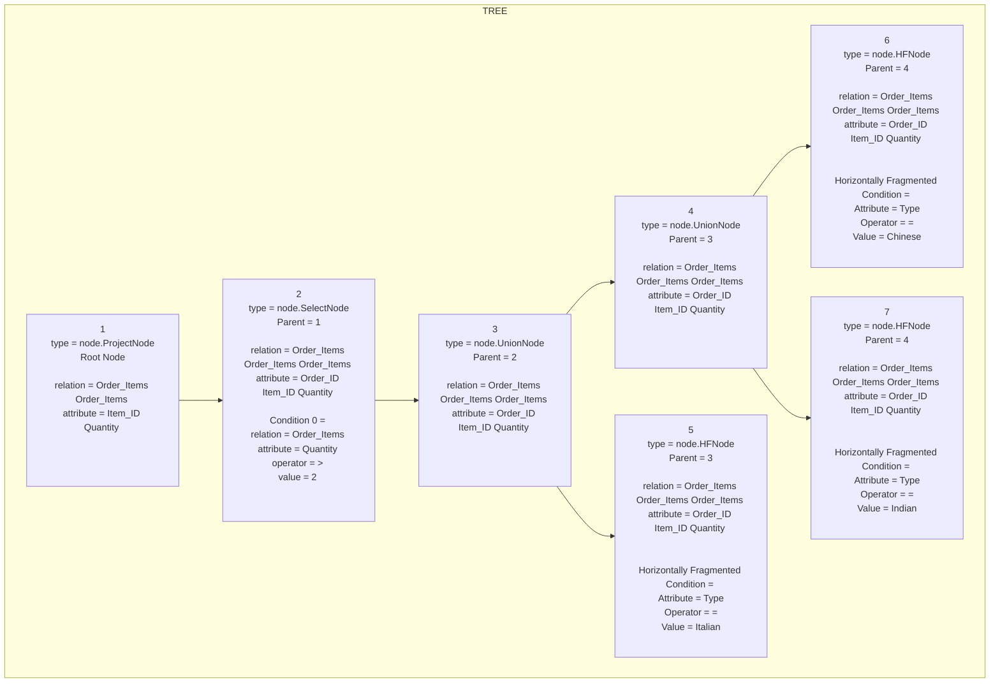

```mermaid
graph TD
subgraph TREE
1[1<br/>type = node.ProjectNode<br/>Root Node<br/><br/>relation = Order_Items Order_Items <br/>attribute = Item_ID Quantity <br/><br/><br/><br/>]
2[2<br/>type = node.SelectNode<br/>Parent = 1<br/><br/>relation = Order_Items Order_Items Order_Items <br/>attribute = Order_ID Item_ID Quantity <br/><br/>Condition 0 = <br/>relation = Order_Items <br/>attribute = Quantity <br/>operator = > <br/>value = 2 <br/><br/><br/>]
1-->2
3[3<br/>type = node.UnionNode<br/>Parent = 2<br/><br/>relation = Order_Items Order_Items Order_Items <br/>attribute = Order_ID Item_ID Quantity <br/><br/><br/><br/>]
2-->3
4[4<br/>type = node.UnionNode<br/>Parent = 3<br/><br/>relation = Order_Items Order_Items Order_Items <br/>attribute = Order_ID Item_ID Quantity <br/><br/><br/><br/>]
3-->4
5[5<br/>type = node.HFNode<br/>Parent = 3<br/><br/>relation = Order_Items Order_Items Order_Items <br/>attribute = Order_ID Item_ID Quantity <br/><br/><br/>Horizontally Fragmented Condition = <br/>Attribute = Type<br/>Operator = =<br/>Value = Italian<br/><br/>]
3-->5
6[6<br/>type = node.HFNode<br/>Parent = 4<br/><br/>relation = Order_Items Order_Items Order_Items <br/>attribute = Order_ID Item_ID Quantity <br/><br/><br/>Horizontally Fragmented Condition = <br/>Attribute = Type<br/>Operator = =<br/>Value = Chinese<br/><br/>]
4-->6
7[7<br/>type = node.HFNode<br/>Parent = 4<br/><br/>relation = Order_Items Order_Items Order_Items <br/>attribute = Order_ID Item_ID Quantity <br/><br/><br/>Horizontally Fragmented Condition = <br/>Attribute = Type<br/>Operator = =<br/>Value = Indian<br/><br/>]
4-->7
end
```