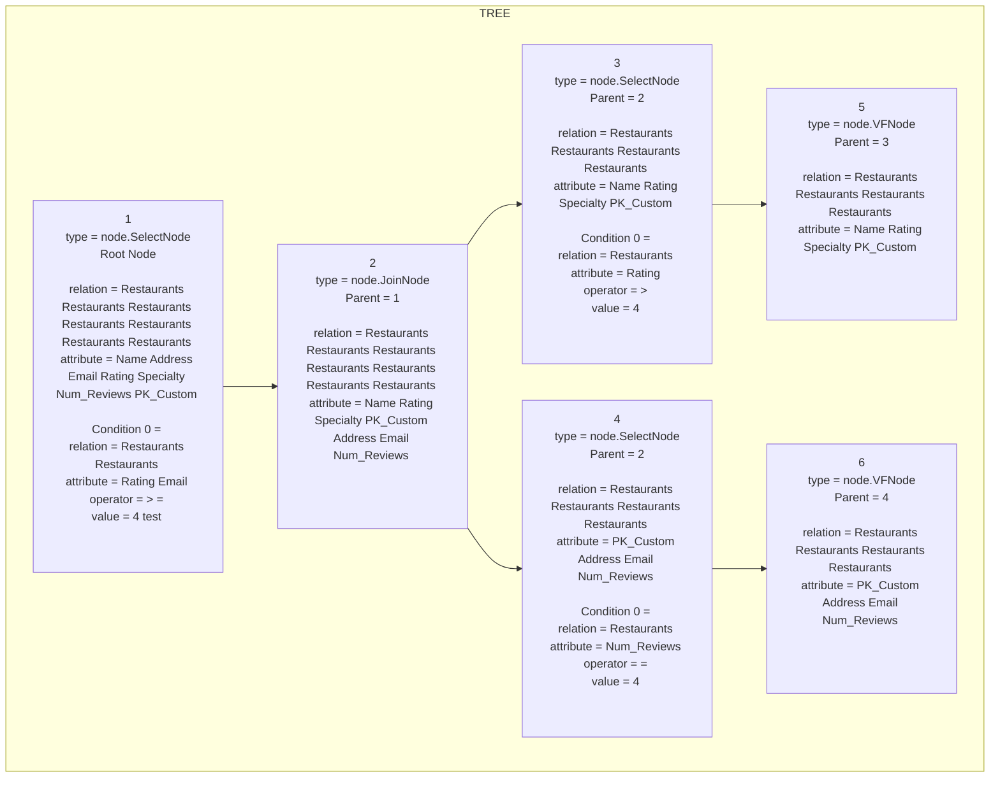

```mermaid
graph TD
subgraph TREE
1[1<br/>type = node.SelectNode<br/>Root Node<br/><br/>relation = Restaurants Restaurants Restaurants Restaurants Restaurants Restaurants Restaurants <br/>attribute = Name Address Email Rating Specialty Num_Reviews PK_Custom <br/><br/>Condition 0 = <br/>relation = Restaurants Restaurants <br/>attribute = Rating Email <br/>operator = > = <br/>value = 4 test <br/><br/><br/>]
2[2<br/>type = node.JoinNode<br/>Parent = 1<br/><br/>relation = Restaurants Restaurants Restaurants Restaurants Restaurants Restaurants Restaurants <br/>attribute = Name Rating Specialty PK_Custom Address Email Num_Reviews <br/><br/><br/><br/>]
1-->2
3[3<br/>type = node.SelectNode<br/>Parent = 2<br/><br/>relation = Restaurants Restaurants Restaurants Restaurants <br/>attribute = Name Rating Specialty PK_Custom <br/><br/>Condition 0 = <br/>relation = Restaurants <br/>attribute = Rating <br/>operator = > <br/>value = 4 <br/><br/><br/>]
2-->3
4[4<br/>type = node.SelectNode<br/>Parent = 2<br/><br/>relation = Restaurants Restaurants Restaurants Restaurants <br/>attribute = PK_Custom Address Email Num_Reviews <br/><br/>Condition 0 = <br/>relation = Restaurants <br/>attribute = Num_Reviews <br/>operator = = <br/>value = 4 <br/><br/><br/>]
2-->4
5[5<br/>type = node.VFNode<br/>Parent = 3<br/><br/>relation = Restaurants Restaurants Restaurants Restaurants <br/>attribute = Name Rating Specialty PK_Custom <br/><br/><br/><br/>]
3-->5
6[6<br/>type = node.VFNode<br/>Parent = 4<br/><br/>relation = Restaurants Restaurants Restaurants Restaurants <br/>attribute = PK_Custom Address Email Num_Reviews <br/><br/><br/><br/>]
4-->6
end
```