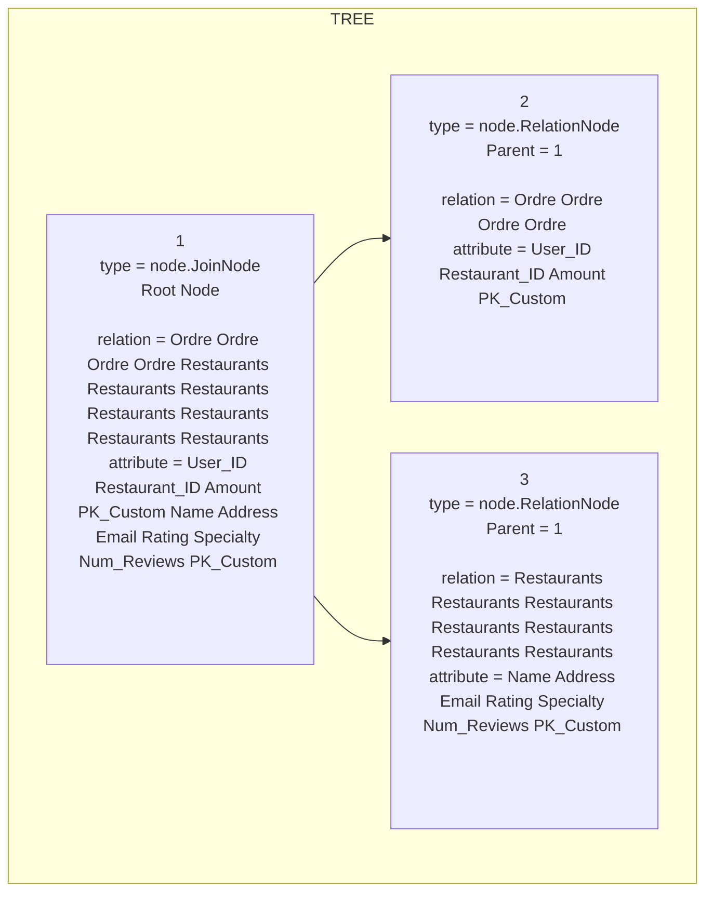

```mermaid
graph TD
subgraph TREE
1[1<br/>type = node.JoinNode<br/>Root Node<br/><br/>relation = Ordre Ordre Ordre Ordre Restaurants Restaurants Restaurants Restaurants Restaurants Restaurants Restaurants <br/>attribute = User_ID Restaurant_ID Amount PK_Custom Name Address Email Rating Specialty Num_Reviews PK_Custom <br/><br/><br/><br/>]
2[2<br/>type = node.RelationNode<br/>Parent = 1<br/><br/>relation = Ordre Ordre Ordre Ordre <br/>attribute = User_ID Restaurant_ID Amount PK_Custom <br/><br/><br/><br/>]
1-->2
3[3<br/>type = node.RelationNode<br/>Parent = 1<br/><br/>relation = Restaurants Restaurants Restaurants Restaurants Restaurants Restaurants Restaurants <br/>attribute = Name Address Email Rating Specialty Num_Reviews PK_Custom <br/><br/><br/><br/>]
1-->3
end
```