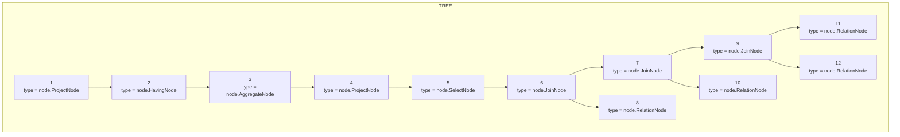

```mermaid
graph TD
subgraph TREE
1[1<br/>type = node.ProjectNode<br/>]
2[2<br/>type = node.HavingNode<br/>]
1-->2
3[3<br/>type = node.AggregateNode<br/>]
2-->3
4[4<br/>type = node.ProjectNode<br/>]
3-->4
5[5<br/>type = node.SelectNode<br/>]
4-->5
6[6<br/>type = node.JoinNode<br/>]
5-->6
7[7<br/>type = node.JoinNode<br/>]
6-->7
8[8<br/>type = node.RelationNode<br/>]
6-->8
9[9<br/>type = node.JoinNode<br/>]
7-->9
10[10<br/>type = node.RelationNode<br/>]
7-->10
11[11<br/>type = node.RelationNode<br/>]
9-->11
12[12<br/>type = node.RelationNode<br/>]
9-->12
end
```