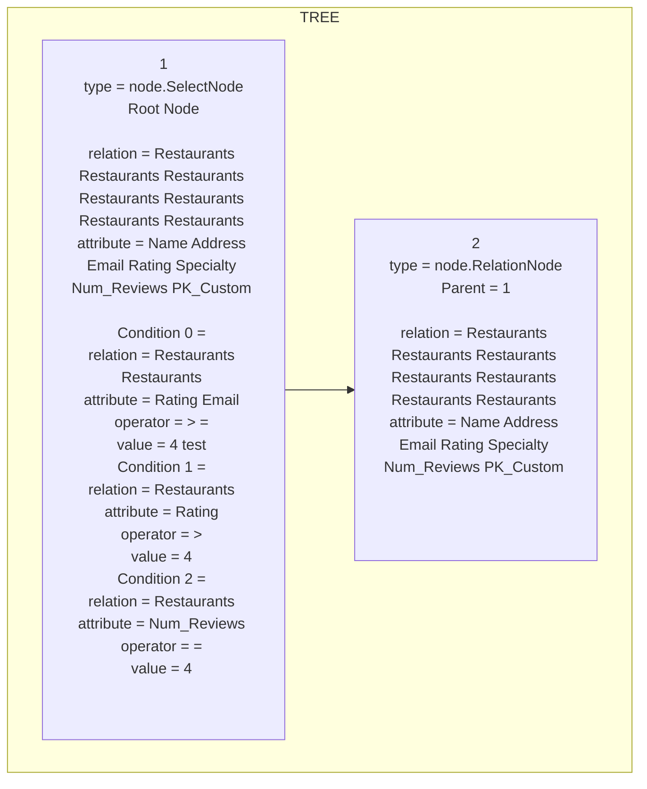

```mermaid
graph TD
subgraph TREE
1[1<br/>type = node.SelectNode<br/>Root Node<br/><br/>relation = Restaurants Restaurants Restaurants Restaurants Restaurants Restaurants Restaurants <br/>attribute = Name Address Email Rating Specialty Num_Reviews PK_Custom <br/><br/>Condition 0 = <br/>relation = Restaurants Restaurants <br/>attribute = Rating Email <br/>operator = > = <br/>value = 4 test <br/>Condition 1 = <br/>relation = Restaurants <br/>attribute = Rating <br/>operator = > <br/>value = 4 <br/>Condition 2 = <br/>relation = Restaurants <br/>attribute = Num_Reviews <br/>operator = = <br/>value = 4 <br/><br/><br/>]
2[2<br/>type = node.RelationNode<br/>Parent = 1<br/><br/>relation = Restaurants Restaurants Restaurants Restaurants Restaurants Restaurants Restaurants <br/>attribute = Name Address Email Rating Specialty Num_Reviews PK_Custom <br/><br/><br/><br/>]
1-->2
end
```