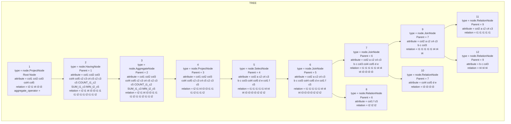

```mermaid
graph TD
subgraph TREE
1[1<br/>type = node.ProjectNode<br/>Root Node<br/>attribute = col1 col2 col3 col4 col5 <br/>relation = t2 t1 t4 t3 t3 <br/>aggregate_operator =      <br/>]
2[2<br/>type = node.HavingNode<br/>Parent = 1<br/>attribute = col1 col2 col3 col4 col5 c2 c3 c4 c5 c2 c3 c5 COUNT_t1_c2 SUM_t1_c3 MIN_t2_c5 <br/>relation = t2 t1 t4 t3 t3 t1 t1 t1 t2 t1 t1 t2 t1 t1 t2 <br/>]
1-->2
3[3<br/>type = node.AggregateNode<br/>Parent = 2<br/>attribute = col1 col2 col3 col4 col5 c2 c3 c4 c5 c2 c3 c5 COUNT_t1_c2 SUM_t1_c3 MIN_t2_c5 <br/>relation = t2 t1 t4 t3 t3 t1 t1 t1 t2 t1 t1 t2 t1 t1 t2 <br/>]
2-->3
4[4<br/>type = node.ProjectNode<br/>Parent = 3<br/>attribute = col1 col2 col3 col4 col5 c2 c3 c4 c5 c2 c3 c5 <br/>relation = t2 t1 t4 t3 t3 t1 t1 t1 t2 t1 t1 t2 <br/>]
3-->4
5[5<br/>type = node.SelectNode<br/>Parent = 4<br/>attribute = col2 a c2 c4 c3 b c col3 col4 col5 d e col1 f c5 <br/>relation = t1 t1 t1 t1 t1 t4 t4 t4 t3 t3 t3 t3 t2 t2 t2 <br/>]
4-->5
6[6<br/>type = node.JoinNode<br/>Parent = 5<br/>attribute = col2 a c2 c4 c3 b c col3 col4 col5 d e col1 f c5 <br/>relation = t1 t1 t1 t1 t1 t4 t4 t4 t3 t3 t3 t3 t2 t2 t2 <br/>]
5-->6
7[7<br/>type = node.JoinNode<br/>Parent = 6<br/>attribute = col2 a c2 c4 c3 b c col3 col4 col5 d e <br/>relation = t1 t1 t1 t1 t1 t4 t4 t4 t3 t3 t3 t3 <br/>]
6-->7
8[8<br/>type = node.RelationNode<br/>Parent = 6<br/>attribute = col1 f c5 <br/>relation = t2 t2 t2 <br/>]
6-->8
9[9<br/>type = node.JoinNode<br/>Parent = 7<br/>attribute = col2 a c2 c4 c3 b c col3 <br/>relation = t1 t1 t1 t1 t1 t4 t4 t4 <br/>]
7-->9
10[10<br/>type = node.RelationNode<br/>Parent = 7<br/>attribute = col4 col5 d e <br/>relation = t3 t3 t3 t3 <br/>]
7-->10
11[11<br/>type = node.RelationNode<br/>Parent = 9<br/>attribute = col2 a c2 c4 c3 <br/>relation = t1 t1 t1 t1 t1 <br/>]
9-->11
12[12<br/>type = node.RelationNode<br/>Parent = 9<br/>attribute = b c col3 <br/>relation = t4 t4 t4 <br/>]
9-->12
end
```