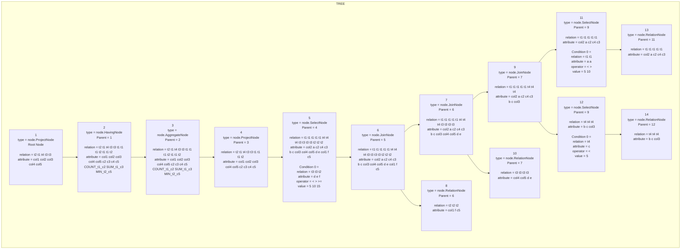

```mermaid
graph TD
subgraph TREE
1[1<br/>type = node.ProjectNode<br/>Root Node<br/><br/>relation = t2 t1 t4 t3 t3 <br/>attribute = col1 col2 col3 col4 col5 <br/><br/><br/><br/>]
2[2<br/>type = node.HavingNode<br/>Parent = 1<br/><br/>relation = t2 t1 t4 t3 t3 t1 t1 t1 t2 t1 t1 t2 <br/>attribute = col1 col2 col3 col4 col5 c2 c3 c4 c5 COUNT_t1_c2 SUM_t1_c3 MIN_t2_c5 <br/><br/><br/><br/>]
1-->2
3[3<br/>type = node.AggregateNode<br/>Parent = 2<br/><br/>relation = t2 t1 t4 t3 t3 t1 t1 t1 t2 t1 t1 t2 <br/>attribute = col1 col2 col3 col4 col5 c2 c3 c4 c5 COUNT_t1_c2 SUM_t1_c3 MIN_t2_c5 <br/><br/><br/><br/>]
2-->3
4[4<br/>type = node.ProjectNode<br/>Parent = 3<br/><br/>relation = t2 t1 t4 t3 t3 t1 t1 t1 t2 <br/>attribute = col1 col2 col3 col4 col5 c2 c3 c4 c5 <br/><br/><br/><br/>]
3-->4
5[5<br/>type = node.SelectNode<br/>Parent = 4<br/><br/>relation = t1 t1 t1 t1 t1 t4 t4 t4 t3 t3 t3 t3 t2 t2 t2 <br/>attribute = col2 a c2 c4 c3 b c col3 col4 col5 d e col1 f c5 <br/><br/>Condition 0 = <br/>relation = t3 t3 t2 <br/>attribute = d e f <br/>operator = < > >= <br/>value = 5 10 15 <br/><br/><br/>]
4-->5
6[6<br/>type = node.JoinNode<br/>Parent = 5<br/><br/>relation = t1 t1 t1 t1 t1 t4 t4 t4 t3 t3 t3 t3 t2 t2 t2 <br/>attribute = col2 a c2 c4 c3 b c col3 col4 col5 d e col1 f c5 <br/><br/><br/><br/>]
5-->6
7[7<br/>type = node.JoinNode<br/>Parent = 6<br/><br/>relation = t1 t1 t1 t1 t1 t4 t4 t4 t3 t3 t3 t3 <br/>attribute = col2 a c2 c4 c3 b c col3 col4 col5 d e <br/><br/><br/><br/>]
6-->7
8[8<br/>type = node.RelationNode<br/>Parent = 6<br/><br/>relation = t2 t2 t2 <br/>attribute = col1 f c5 <br/><br/><br/><br/>]
6-->8
9[9<br/>type = node.JoinNode<br/>Parent = 7<br/><br/>relation = t1 t1 t1 t1 t1 t4 t4 t4 <br/>attribute = col2 a c2 c4 c3 b c col3 <br/><br/><br/><br/>]
7-->9
10[10<br/>type = node.RelationNode<br/>Parent = 7<br/><br/>relation = t3 t3 t3 t3 <br/>attribute = col4 col5 d e <br/><br/><br/><br/>]
7-->10
11[11<br/>type = node.SelectNode<br/>Parent = 9<br/><br/>relation = t1 t1 t1 t1 t1 <br/>attribute = col2 a c2 c4 c3 <br/><br/>Condition 0 = <br/>relation = t1 t1 <br/>attribute = a a <br/>operator = < > <br/>value = 5 10 <br/><br/><br/>]
9-->11
12[12<br/>type = node.SelectNode<br/>Parent = 9<br/><br/>relation = t4 t4 t4 <br/>attribute = b c col3 <br/><br/>Condition 0 = <br/>relation = t4 <br/>attribute = c <br/>operator = < <br/>value = 5 <br/><br/><br/>]
9-->12
13[13<br/>type = node.RelationNode<br/>Parent = 11<br/><br/>relation = t1 t1 t1 t1 t1 <br/>attribute = col2 a c2 c4 c3 <br/><br/><br/><br/>]
11-->13
14[14<br/>type = node.RelationNode<br/>Parent = 12<br/><br/>relation = t4 t4 t4 <br/>attribute = b c col3 <br/><br/><br/><br/>]
12-->14
end
```