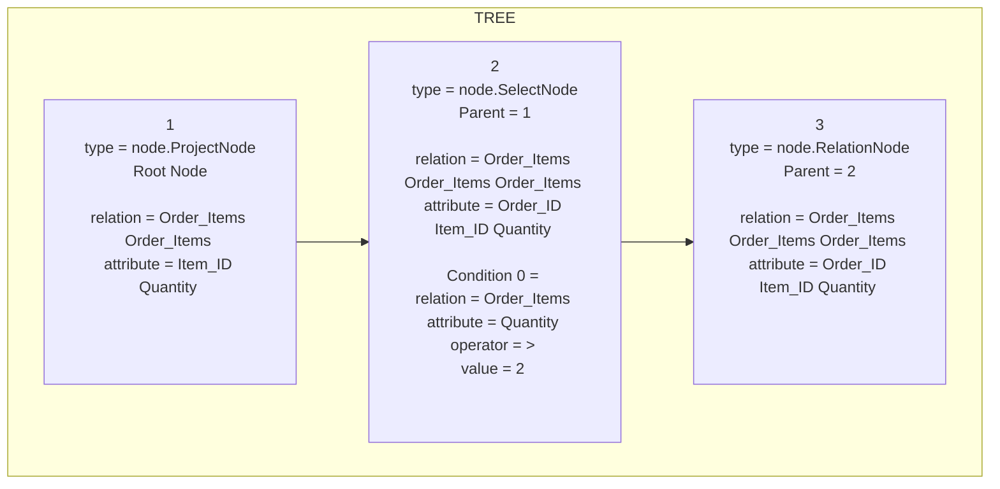

```mermaid
graph TD
subgraph TREE
1[1<br/>type = node.ProjectNode<br/>Root Node<br/><br/>relation = Order_Items Order_Items <br/>attribute = Item_ID Quantity <br/><br/><br/><br/>]
2[2<br/>type = node.SelectNode<br/>Parent = 1<br/><br/>relation = Order_Items Order_Items Order_Items <br/>attribute = Order_ID Item_ID Quantity <br/><br/>Condition 0 = <br/>relation = Order_Items <br/>attribute = Quantity <br/>operator = > <br/>value = 2 <br/><br/><br/>]
1-->2
3[3<br/>type = node.RelationNode<br/>Parent = 2<br/><br/>relation = Order_Items Order_Items Order_Items <br/>attribute = Order_ID Item_ID Quantity <br/><br/><br/><br/>]
2-->3
end
```