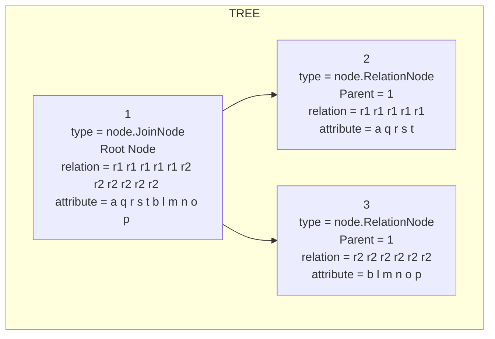

```mermaid
graph TD
subgraph TREE
1[1<br/>type = node.JoinNode<br/>Root Node<br/>relation = r1 r1 r1 r1 r1 r2 r2 r2 r2 r2 r2 <br/>attribute = a q r s t b l m n o p <br/>]
2[2<br/>type = node.RelationNode<br/>Parent = 1<br/>relation = r1 r1 r1 r1 r1 <br/>attribute = a q r s t <br/>]
1-->2
3[3<br/>type = node.RelationNode<br/>Parent = 1<br/>relation = r2 r2 r2 r2 r2 r2 <br/>attribute = b l m n o p <br/>]
1-->3
end
```