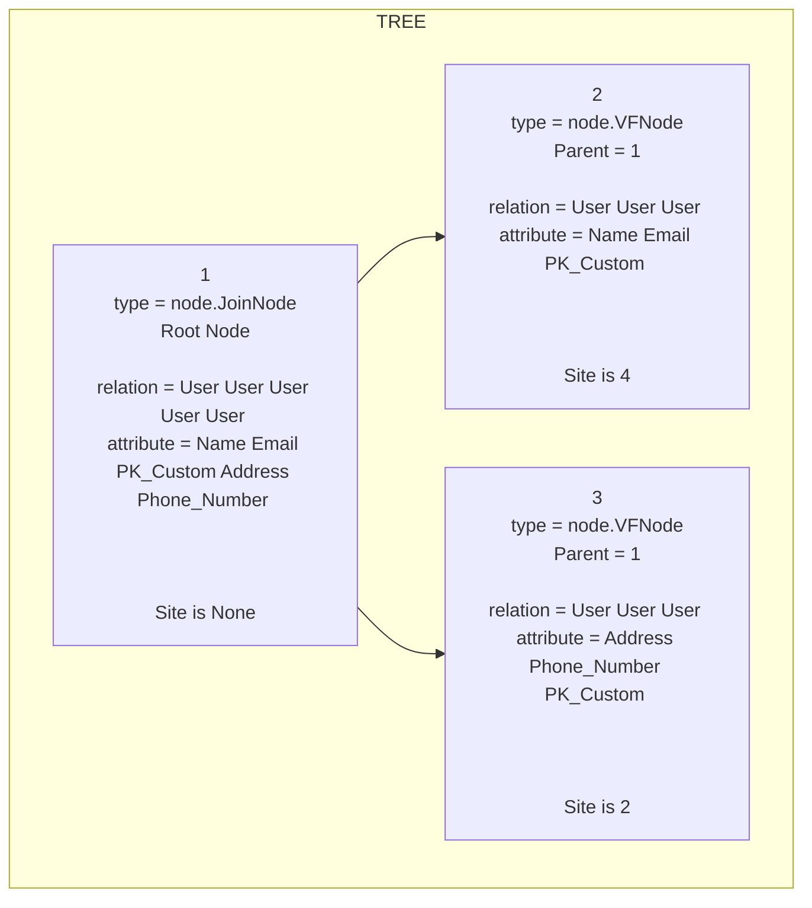

```mermaid
graph TD
subgraph TREE
1[1<br/>type = node.JoinNode<br/>Root Node<br/><br/>relation = User User User User User <br/>attribute = Name Email PK_Custom Address Phone_Number <br/><br/><br/><br/>Site is None<br/>]
2[2<br/>type = node.VFNode<br/>Parent = 1<br/><br/>relation = User User User <br/>attribute = Name Email PK_Custom <br/><br/><br/><br/>Site is 4<br/>]
1-->2
3[3<br/>type = node.VFNode<br/>Parent = 1<br/><br/>relation = User User User <br/>attribute = Address Phone_Number PK_Custom <br/><br/><br/><br/>Site is 2<br/>]
1-->3
end
```