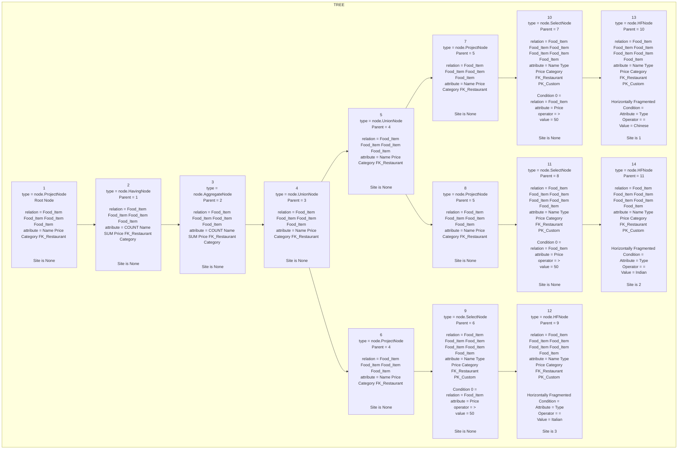

```mermaid
graph TD
subgraph TREE
1[1<br/>type = node.ProjectNode<br/>Root Node<br/><br/>relation = Food_Item Food_Item Food_Item Food_Item <br/>attribute = Name Price Category FK_Restaurant <br/><br/><br/><br/>Site is None<br/>]
2[2<br/>type = node.HavingNode<br/>Parent = 1<br/><br/>relation = Food_Item Food_Item Food_Item Food_Item <br/>attribute = COUNT Name SUM Price FK_Restaurant Category <br/><br/><br/><br/>Site is None<br/>]
1-->2
3[3<br/>type = node.AggregateNode<br/>Parent = 2<br/><br/>relation = Food_Item Food_Item Food_Item Food_Item <br/>attribute = COUNT Name SUM Price FK_Restaurant Category <br/><br/><br/><br/>Site is None<br/>]
2-->3
4[4<br/>type = node.UnionNode<br/>Parent = 3<br/><br/>relation = Food_Item Food_Item Food_Item Food_Item <br/>attribute = Name Price Category FK_Restaurant <br/><br/><br/><br/>Site is None<br/>]
3-->4
5[5<br/>type = node.UnionNode<br/>Parent = 4<br/><br/>relation = Food_Item Food_Item Food_Item Food_Item <br/>attribute = Name Price Category FK_Restaurant <br/><br/><br/><br/>Site is None<br/>]
4-->5
6[6<br/>type = node.ProjectNode<br/>Parent = 4<br/><br/>relation = Food_Item Food_Item Food_Item Food_Item <br/>attribute = Name Price Category FK_Restaurant <br/><br/><br/><br/>Site is None<br/>]
4-->6
7[7<br/>type = node.ProjectNode<br/>Parent = 5<br/><br/>relation = Food_Item Food_Item Food_Item Food_Item <br/>attribute = Name Price Category FK_Restaurant <br/><br/><br/><br/>Site is None<br/>]
5-->7
8[8<br/>type = node.ProjectNode<br/>Parent = 5<br/><br/>relation = Food_Item Food_Item Food_Item Food_Item <br/>attribute = Name Price Category FK_Restaurant <br/><br/><br/><br/>Site is None<br/>]
5-->8
9[9<br/>type = node.SelectNode<br/>Parent = 6<br/><br/>relation = Food_Item Food_Item Food_Item Food_Item Food_Item Food_Item <br/>attribute = Name Type Price Category FK_Restaurant PK_Custom <br/><br/>Condition 0 = <br/>relation = Food_Item <br/>attribute = Price <br/>operator = > <br/>value = 50 <br/><br/><br/>Site is None<br/>]
6-->9
10[10<br/>type = node.SelectNode<br/>Parent = 7<br/><br/>relation = Food_Item Food_Item Food_Item Food_Item Food_Item Food_Item <br/>attribute = Name Type Price Category FK_Restaurant PK_Custom <br/><br/>Condition 0 = <br/>relation = Food_Item <br/>attribute = Price <br/>operator = > <br/>value = 50 <br/><br/><br/>Site is None<br/>]
7-->10
11[11<br/>type = node.SelectNode<br/>Parent = 8<br/><br/>relation = Food_Item Food_Item Food_Item Food_Item Food_Item Food_Item <br/>attribute = Name Type Price Category FK_Restaurant PK_Custom <br/><br/>Condition 0 = <br/>relation = Food_Item <br/>attribute = Price <br/>operator = > <br/>value = 50 <br/><br/><br/>Site is None<br/>]
8-->11
12[12<br/>type = node.HFNode<br/>Parent = 9<br/><br/>relation = Food_Item Food_Item Food_Item Food_Item Food_Item Food_Item <br/>attribute = Name Type Price Category FK_Restaurant PK_Custom <br/><br/><br/>Horizontally Fragmented Condition = <br/>Attribute = Type<br/>Operator = =<br/>Value = Italian<br/><br/>Site is 3<br/>]
9-->12
13[13<br/>type = node.HFNode<br/>Parent = 10<br/><br/>relation = Food_Item Food_Item Food_Item Food_Item Food_Item Food_Item <br/>attribute = Name Type Price Category FK_Restaurant PK_Custom <br/><br/><br/>Horizontally Fragmented Condition = <br/>Attribute = Type<br/>Operator = =<br/>Value = Chinese<br/><br/>Site is 1<br/>]
10-->13
14[14<br/>type = node.HFNode<br/>Parent = 11<br/><br/>relation = Food_Item Food_Item Food_Item Food_Item Food_Item Food_Item <br/>attribute = Name Type Price Category FK_Restaurant PK_Custom <br/><br/><br/>Horizontally Fragmented Condition = <br/>Attribute = Type<br/>Operator = =<br/>Value = Indian<br/><br/>Site is 2<br/>]
11-->14
end
```