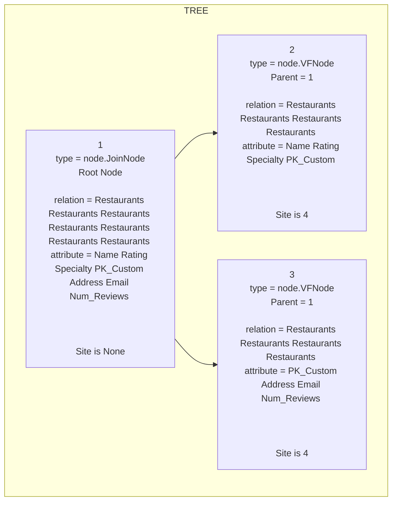

```mermaid
graph TD
subgraph TREE
1[1<br/>type = node.JoinNode<br/>Root Node<br/><br/>relation = Restaurants Restaurants Restaurants Restaurants Restaurants Restaurants Restaurants <br/>attribute = Name Rating Specialty PK_Custom Address Email Num_Reviews <br/><br/><br/><br/>Site is None<br/>]
2[2<br/>type = node.VFNode<br/>Parent = 1<br/><br/>relation = Restaurants Restaurants Restaurants Restaurants <br/>attribute = Name Rating Specialty PK_Custom <br/><br/><br/><br/>Site is 4<br/>]
1-->2
3[3<br/>type = node.VFNode<br/>Parent = 1<br/><br/>relation = Restaurants Restaurants Restaurants Restaurants <br/>attribute = PK_Custom Address Email Num_Reviews <br/><br/><br/><br/>Site is 4<br/>]
1-->3
end
```