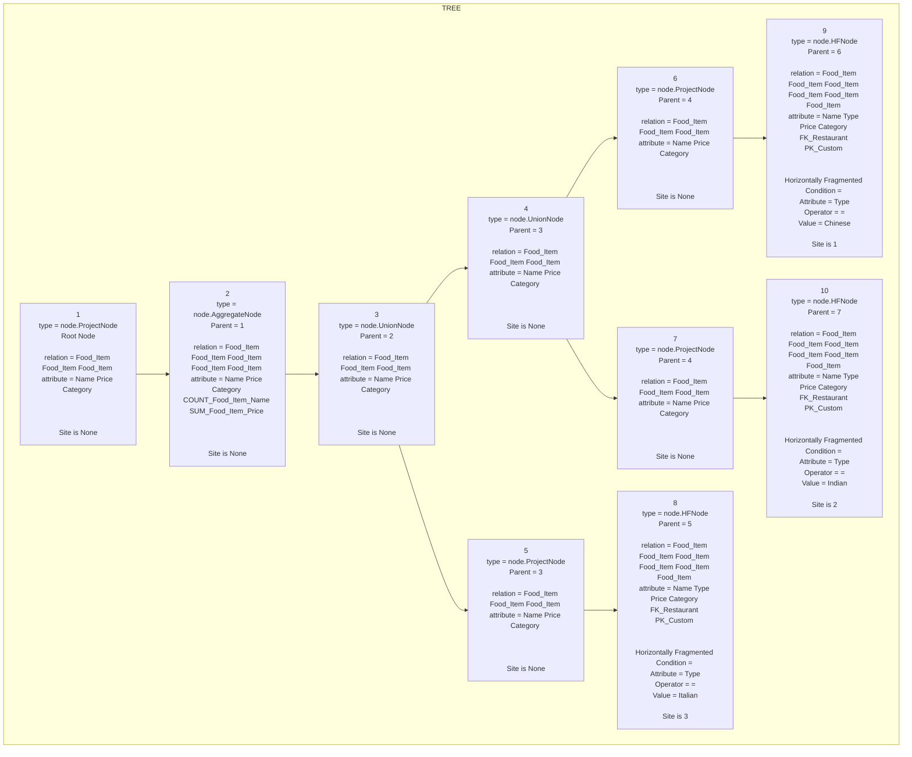

```mermaid
graph TD
subgraph TREE
1[1<br/>type = node.ProjectNode<br/>Root Node<br/><br/>relation = Food_Item Food_Item Food_Item <br/>attribute = Name Price Category <br/><br/><br/><br/>Site is None<br/>]
2[2<br/>type = node.AggregateNode<br/>Parent = 1<br/><br/>relation = Food_Item Food_Item Food_Item Food_Item Food_Item <br/>attribute = Name Price Category COUNT_Food_Item_Name SUM_Food_Item_Price <br/><br/><br/><br/>Site is None<br/>]
1-->2
3[3<br/>type = node.UnionNode<br/>Parent = 2<br/><br/>relation = Food_Item Food_Item Food_Item <br/>attribute = Name Price Category <br/><br/><br/><br/>Site is None<br/>]
2-->3
4[4<br/>type = node.UnionNode<br/>Parent = 3<br/><br/>relation = Food_Item Food_Item Food_Item <br/>attribute = Name Price Category <br/><br/><br/><br/>Site is None<br/>]
3-->4
5[5<br/>type = node.ProjectNode<br/>Parent = 3<br/><br/>relation = Food_Item Food_Item Food_Item <br/>attribute = Name Price Category <br/><br/><br/><br/>Site is None<br/>]
3-->5
6[6<br/>type = node.ProjectNode<br/>Parent = 4<br/><br/>relation = Food_Item Food_Item Food_Item <br/>attribute = Name Price Category <br/><br/><br/><br/>Site is None<br/>]
4-->6
7[7<br/>type = node.ProjectNode<br/>Parent = 4<br/><br/>relation = Food_Item Food_Item Food_Item <br/>attribute = Name Price Category <br/><br/><br/><br/>Site is None<br/>]
4-->7
8[8<br/>type = node.HFNode<br/>Parent = 5<br/><br/>relation = Food_Item Food_Item Food_Item Food_Item Food_Item Food_Item <br/>attribute = Name Type Price Category FK_Restaurant PK_Custom <br/><br/><br/>Horizontally Fragmented Condition = <br/>Attribute = Type<br/>Operator = =<br/>Value = Italian<br/><br/>Site is 3<br/>]
5-->8
9[9<br/>type = node.HFNode<br/>Parent = 6<br/><br/>relation = Food_Item Food_Item Food_Item Food_Item Food_Item Food_Item <br/>attribute = Name Type Price Category FK_Restaurant PK_Custom <br/><br/><br/>Horizontally Fragmented Condition = <br/>Attribute = Type<br/>Operator = =<br/>Value = Chinese<br/><br/>Site is 1<br/>]
6-->9
10[10<br/>type = node.HFNode<br/>Parent = 7<br/><br/>relation = Food_Item Food_Item Food_Item Food_Item Food_Item Food_Item <br/>attribute = Name Type Price Category FK_Restaurant PK_Custom <br/><br/><br/>Horizontally Fragmented Condition = <br/>Attribute = Type<br/>Operator = =<br/>Value = Indian<br/><br/>Site is 2<br/>]
7-->10
end
```