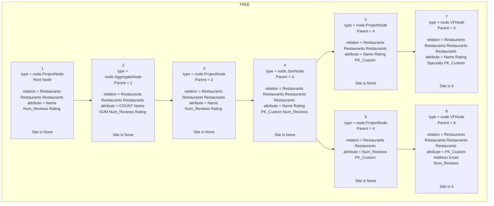

```mermaid
graph TD
subgraph TREE
1[1<br/>type = node.ProjectNode<br/>Root Node<br/><br/>relation = Restaurants Restaurants Restaurants <br/>attribute = Name Num_Reviews Rating <br/><br/><br/><br/>Site is None<br/>]
2[2<br/>type = node.AggregateNode<br/>Parent = 1<br/><br/>relation = Restaurants Restaurants Restaurants <br/>attribute = COUNT Name SUM Num_Reviews Rating <br/><br/><br/><br/>Site is None<br/>]
1-->2
3[3<br/>type = node.ProjectNode<br/>Parent = 2<br/><br/>relation = Restaurants Restaurants Restaurants <br/>attribute = Name Num_Reviews Rating <br/><br/><br/><br/>Site is None<br/>]
2-->3
4[4<br/>type = node.JoinNode<br/>Parent = 3<br/><br/>relation = Restaurants Restaurants Restaurants Restaurants <br/>attribute = Name Rating PK_Custom Num_Reviews <br/><br/><br/><br/>Site is None<br/>]
3-->4
5[5<br/>type = node.ProjectNode<br/>Parent = 4<br/><br/>relation = Restaurants Restaurants Restaurants <br/>attribute = Name Rating PK_Custom <br/><br/><br/><br/>Site is None<br/>]
4-->5
6[6<br/>type = node.ProjectNode<br/>Parent = 4<br/><br/>relation = Restaurants Restaurants <br/>attribute = Num_Reviews PK_Custom <br/><br/><br/><br/>Site is None<br/>]
4-->6
7[7<br/>type = node.VFNode<br/>Parent = 5<br/><br/>relation = Restaurants Restaurants Restaurants Restaurants <br/>attribute = Name Rating Specialty PK_Custom <br/><br/><br/><br/>Site is 4<br/>]
5-->7
8[8<br/>type = node.VFNode<br/>Parent = 6<br/><br/>relation = Restaurants Restaurants Restaurants Restaurants <br/>attribute = PK_Custom Address Email Num_Reviews <br/><br/><br/><br/>Site is 4<br/>]
6-->8
end
```