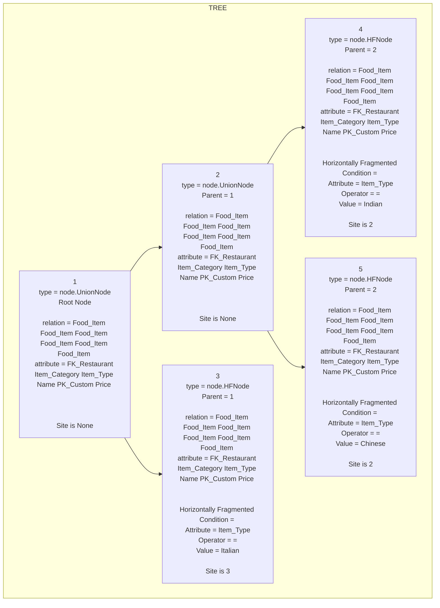

```mermaid
graph TD
subgraph TREE
1[1<br/>type = node.UnionNode<br/>Root Node<br/><br/>relation = Food_Item Food_Item Food_Item Food_Item Food_Item Food_Item <br/>attribute = FK_Restaurant Item_Category Item_Type Name PK_Custom Price <br/><br/><br/><br/>Site is None<br/>]
2[2<br/>type = node.UnionNode<br/>Parent = 1<br/><br/>relation = Food_Item Food_Item Food_Item Food_Item Food_Item Food_Item <br/>attribute = FK_Restaurant Item_Category Item_Type Name PK_Custom Price <br/><br/><br/><br/>Site is None<br/>]
1-->2
3[3<br/>type = node.HFNode<br/>Parent = 1<br/><br/>relation = Food_Item Food_Item Food_Item Food_Item Food_Item Food_Item <br/>attribute = FK_Restaurant Item_Category Item_Type Name PK_Custom Price <br/><br/><br/>Horizontally Fragmented Condition = <br/>Attribute = Item_Type<br/>Operator = =<br/>Value = Italian<br/><br/>Site is 3<br/>]
1-->3
4[4<br/>type = node.HFNode<br/>Parent = 2<br/><br/>relation = Food_Item Food_Item Food_Item Food_Item Food_Item Food_Item <br/>attribute = FK_Restaurant Item_Category Item_Type Name PK_Custom Price <br/><br/><br/>Horizontally Fragmented Condition = <br/>Attribute = Item_Type<br/>Operator = =<br/>Value = Indian<br/><br/>Site is 2<br/>]
2-->4
5[5<br/>type = node.HFNode<br/>Parent = 2<br/><br/>relation = Food_Item Food_Item Food_Item Food_Item Food_Item Food_Item <br/>attribute = FK_Restaurant Item_Category Item_Type Name PK_Custom Price <br/><br/><br/>Horizontally Fragmented Condition = <br/>Attribute = Item_Type<br/>Operator = =<br/>Value = Chinese<br/><br/>Site is 2<br/>]
2-->5
end
```